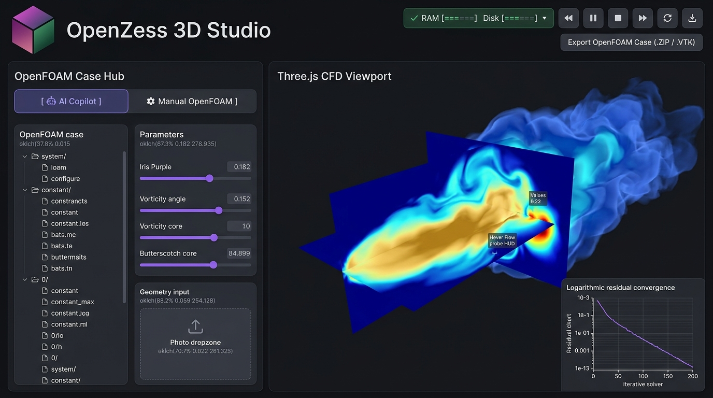
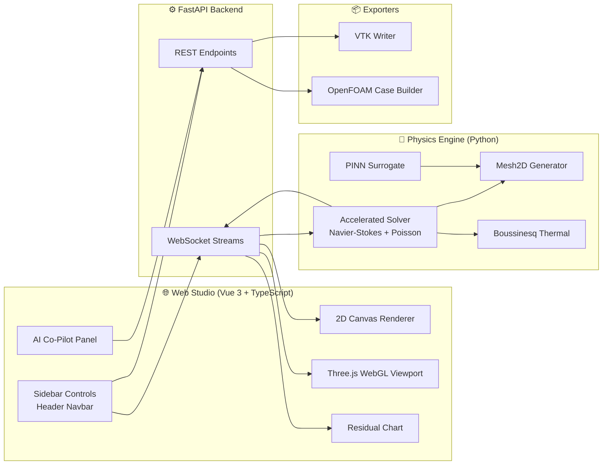

<div align="center">

# ⚡ OpenZess Studio

### Indigenous AI-Native Computational Fluid Dynamics Platform

**Real-time aerothermal simulation · PINN surrogate physics · Three.js WebGL visualization · One-click OpenFOAM & ParaView export**

[](https://www.python.org/)
[](https://fastapi.tiangolo.com/)
[](https://vuejs.org/)
[](https://threejs.org/)
[](https://www.typescriptlang.org/)
[](#-license)


</div>

---

OpenZess Studio is an **AI-native CFD platform inspired by [OpenFOAM](https://www.openfoam.com/)**. It combines a SciPy sparse-accelerated Navier–Stokes solver engine, an instant **PINN surrogate physics layer**, and a **Vue 3 + Three.js Web Studio UI** for real-time aerothermal simulation, scientific visualization, and one-click export of production-ready OpenFOAM cases and ParaView datasets — all running locally in your browser.

<div align="center">
  
</div>

---

## ✨ Key Features

|     | Feature                 | Description                                                                                                                |
| --- | ----------------------- | -------------------------------------------------------------------------------------------------------------------------- |
| 🌊  | **Live CFD Solver**     | Fractional-step incompressible Navier–Stokes with pressure-Poisson correction, accelerated via SciPy sparse linear algebra |
| ⚡  | **PINN Surrogate Mode** | Physics-Informed surrogate delivers instant steady-state flow fields (< 50 ms) for rapid design exploration                |
| 🔥  | **Thermal Buoyancy**    | Boussinesq formulation couples temperature transport with gravity-driven buoyant updrafts                                  |
| 🌌  | **Dual Viewports**      | 2D HTML5 Canvas renderer + immersive Three.js WebGL 3D scene with cross-section slicing                                    |
| 📈  | **Residual Monitor**    | Logarithmic convergence chart (Chart.js) streaming live from the solver                                                    |
| 🤖  | **AI Co-Pilot**         | Conversational assistant for natural-language simulation control                                                           |
| 👁️  | **AI Vision**           | Photo-to-3D voxelization: upload an image, extract silhouette, detect archetype, auto-generate geometry                    |
| 📦  | **OpenFOAM Export**     | Generates complete `buoyantBoussinesqSimpleFoam` case dictionaries (`0/`, `constant/`, `system/`) as a ZIP                 |
| 🧊  | **ParaView Export**     | Legacy structured-points `.vtk` download of any finished run                                                               |
| 🎛️  | **Dict Editor**         | In-browser OpenFOAM dictionary editor with live templates                                                                  |

---

## 🚀 Quick Start

### Prerequisites

- **Python 3.10+**
- **Node.js 18+** (only needed for frontend development)

### Option A — One Command Launch (Recommended)

```bash
# 1. Install backend dependencies
pip install -r requirements.txt

# 2. Launch the studio (starts API server + opens browser automatically)
python main.py
```

The FastAPI server starts at [`http://localhost:8000`](http://localhost:8000) and auto-opens the Web Studio UI in your default browser.

> 💡 If you have built the frontend (`npm run build`), the server serves the optimized bundle from `frontend/dist`. Otherwise it serves the raw frontend sources.

### Option B — Frontend Development Mode (with HMR)

```bash
# Terminal 1 — backend
pip install -r requirements.txt
python main.py

# Terminal 2 — frontend dev server
cd frontend
npm install
npm run dev      # Vite dev server with hot-reload
```

---

## 🖥️ Usage Walkthrough

1. **Pick a preset** — Submarine, Car, Radiator, Server Rack, Table, Chair, or configure a custom case.
2. **Choose a mode** — `CFD` for full numerical solving, or `AI` for instant PINN surrogate results.
3. **Hit simulate** — watch velocity/pressure fields render in real time while residuals converge on the log chart.
4. **Inspect in 3D** — switch to the Three.js viewport for volumetric exploration.
5. **Export** — download a ParaView `.vtk` file or a complete OpenFOAM case `.zip` for high-fidelity continuation.

---

## 🔌 API Reference

| Endpoint                   | Method    | Purpose                                                |
| -------------------------- | --------- | ------------------------------------------------------ |
| `/ws/simulate`             | WebSocket | Real-time frame/residual streaming during simulation   |
| `/ws/simulate_3d`          | WebSocket | 3D simulation frames, residuals & cross-section slices |
| `/api/health`              | GET       | Engine health & feature probe                          |
| `/api/presets`             | GET       | Pre-configured 3D case catalog                         |
| `/api/export/vtk`          | GET       | Download last run as ParaView `.vtk`                   |
| `/api/export/openfoam-zip` | GET       | Download complete OpenFOAM case as `.zip`              |
| `/api/ai/chat`             | POST      | Natural-language AI Co-Pilot                           |
| `/api/ai/vision-analyze`   | POST      | Image silhouette → 3D bounding-box analysis            |

---

## 🏗️ Architecture



**Physics core:** the solver advances each time step through a predictor (upwind advection + central-difference diffusion), solves the pressure Poisson equation with Dirichlet outlet / Neumann wall conditions, then corrects velocities to satisfy continuity — the same fractional-step philosophy used by industrial CFD codes.

📖 Full mathematical derivation: [`docs/PHYSICS_AND_SOLVER.md`](docs/PHYSICS_AND_SOLVER.md)

---

## 🛠️ Tech Stack

| Layer                | Technologies                                                                           |
| -------------------- | -------------------------------------------------------------------------------------- |
| **Backend**          | Python · FastAPI · Uvicorn · NumPy · SciPy (sparse solvers) · WebSockets · Matplotlib  |
| **Frontend**         | Vue 3 · TypeScript · Vite · Three.js · Chart.js · Lucide Icons                         |
| **Physics**          | Incompressible Navier–Stokes · Pressure Poisson · Boussinesq buoyancy · PINN surrogate |
| **Interoperability** | OpenFOAM v2312 dictionary generation · ParaView legacy VTK                             |

---

## 📂 Repository Layout

```
openn_fOam/
├── main.py                  # 🚀 Launcher: starts FastAPI + opens Studio UI
├── requirements.txt         # 📦 Python backend dependencies
│
├── backend/                 # 🧠 Aerothermal & AI physics engine
│   ├── app.py               # FastAPI routes & WebSocket simulation streaming
│   ├── mesh.py              # Structured Cartesian grid generator + obstacle masks
│   ├── solver.py            # Navier–Stokes, pressure Poisson & thermal solver
│   ├── ai_predictor.py      # ⚡ Instant PINN surrogate prediction
│   └── vtk_writer.py        # ParaView legacy .vtk exporter
│
├── frontend/                # 🌐 Vue 3 + TypeScript + Three.js Web Studio
│   └── src/
│       ├── App.vue          # Master split-screen studio coordinator
│       ├── components/      # Canvas2D / Three3D viewports, charts, AI panel,
│       │                    # sidebar controls, OpenFOAM dict editor
│       ├── utils/           # Scientific colormaps & OpenFOAM dict templates
│       └── types/cfd.ts     # TypeScript interfaces for CFD cases
│
├── docs/                    # 📚 Architecture, physics & design documentation
├── saved_chats/             # 💾 Session archives & design mockups
└── graphify-out/            # 🕸️ Codebase dependency-graph reports
```

---

## 📚 Documentation

Complete guides live in the [`docs/`](docs/) directory:

| Document                                                              | Contents                                                       |
| --------------------------------------------------------------------- | -------------------------------------------------------------- |
| [Project Structure](docs/PROJECT_STRUCTURE.md)                        | Complete architectural map, layer-by-layer breakdown           |
| [Physics & Solver](docs/PHYSICS_AND_SOLVER.md)                        | Governing equations, fractional-step method, PINN mode         |
| [OpenFOAM & VTK Export](docs/OPENFOAM_AND_VTK_EXPORT.md)              | Dictionary generation, ZIP packaging, ParaView format          |
| [AI Vision & Copilot](docs/AI_VISION_AND_COPILOT.md)                  | Photo-to-3D voxelization, NL command reference                 |
| [UI/UX Design System](docs/UI_UX_DESIGN_SYSTEM.md)                    | OKLCH color tokens, layout specification, 60–120 FPS rendering |
| [Tech Stack](docs/TECH_STACK.md)                                      | Full technology breakdown                                      |
| [Local Hardware Runtime](docs/LOCAL_HARDWARE_RUNTIME_ARCHITECTURE.md) | Colab-style local CPU/GPU/NVMe bridge                          |
| [Hybrid Rust Research](docs/RESEARCH_AND_HYBRID_RUST_PYTHON.md)       | PyO3 dual-engine research roadmap                              |
| [Rust 2024 Benefits](docs/RUST_2024_BACKEND_BENEFITS.md)              | SIMD, Rayon parallelism, latency benchmarks                    |
| [Things Taken from OpenFOAM](docs/THINGS_TAKEN_FROM_OPENFOAM.md)      | SI dimensional analysis, patch BCs, schemes, coefficients      |

---

## 🗺️ Roadmap

- [ ] Rust 2024 (PyO3) compute kernel for sub-millisecond solver steps
- [ ] GPU acceleration (CUDA) for large 3D domains
- [ ] Turbulence modeling (k-ε / k-ω SST)
- [ ] Unstructured mesh support & adaptive refinement
- [ ] Transient animation recording & video export
- [ ] Live aerodynamic coefficient overlays ($C_D$, $C_L$) in the viewport

---

## 🤝 Contributing

Contributions are welcome! This project was built iteratively with AI pair-programming ([session archives](saved_chats/) document the full design history).

1. Fork the repository
2. Create your feature branch (`git checkout -b feature/amazing-feature`)
3. Commit your changes (`git commit -m 'Add amazing feature'`)
4. Push to the branch (`git push origin feature/amazing-feature`)
5. Open a Pull Request

---

## 🙏 Acknowledgments

- [OpenFOAM®](https://www.openfoam.com/) — the industry-standard open-source CFD toolbox that inspired this project's dictionary structure, boundary-condition model, and numerics
- [12 Steps to Navier–Stokes](https://www.youtube.com/playlist?list=PL30F4C5AB15562EEB) (Lorena Barba) — foundational numerical methods
- The Vue, Three.js, FastAPI & SciPy communities

---

## 📄 License

Licensing is being finalized. Until a license is added, all rights are reserved by the author.

<div align="center">

**Built with ⚡ by the OpenZess project**

⭐ Star this repo if you find it useful!

</div>
