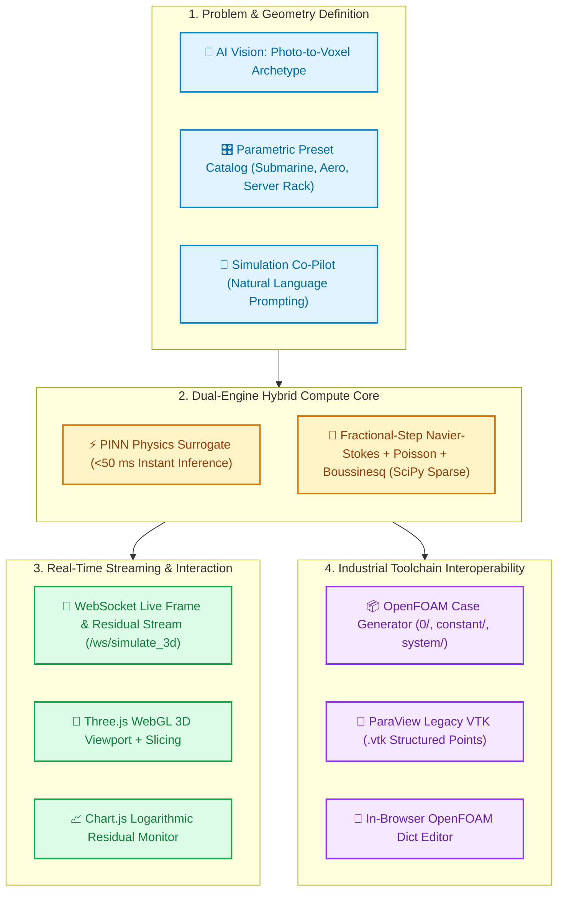
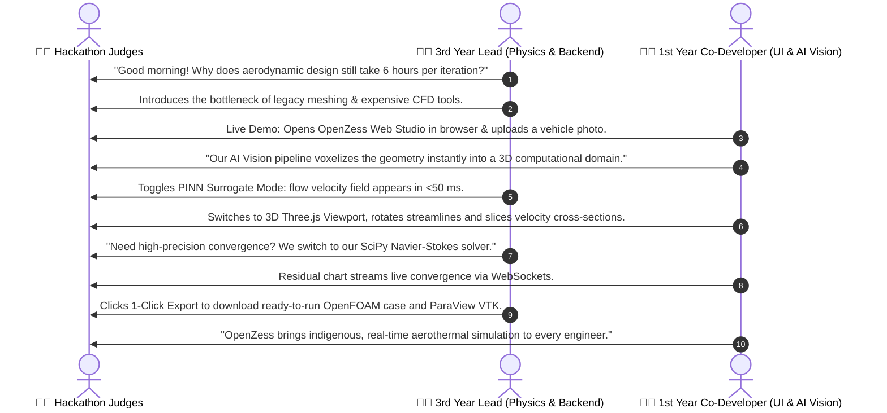

# 🏆 OpenZess Studio — Hackathon Competition & Pitch Master Kit

> **Target Competitions:** Smart India Hackathon (SIH 2026), NASA Space Apps Challenge 2026, L&T Techgium, Shaastra IIT Madras, and devfolio / MLH Flagships.  
> **Team Profile:** SRM IST Chennai (3rd Year Lead + 1st Year Co-Developer Duo).

---

## 📌 Executive Summary

**OpenZess Studio** is an **indigenous, AI-native Computational Fluid Dynamics (CFD) and Aerothermal simulation platform**. It bridges the gap between compute-heavy numerical solvers and real-time interactive design by fusing a SciPy sparse-accelerated Navier–Stokes engine with an instant **Physics-Informed Neural Network (PINN) surrogate**, photo-to-voxel AI vision geometry synthesis, and an immersive **Three.js WebGL 3D Studio** running natively in the browser with one-click OpenFOAM and ParaView export.

---

## 🎯 Competition Mapping & Track Strategies

| Hackathon | Dates / Status | Best Track / Problem Statement | Pitch Angle & Focus |
| :--- | :--- | :--- | :--- |
| **NASA Space Apps Challenge** | **Nov 14–15, 2026** (Registrations Open) | Planetary Atmospheres, Aerodynamics, Climate Modeling & Open Science | *"Real-Time Aerothermal Simulation for Atmospheric & Aerodynamic Vehicle Exploration"*. Highlight real-time fluid dynamics on planetary crafts and browser-based accessibility. |
| **Smart India Hackathon (SIH 2026)** | **Sept–Dec 2026** (Internal college round in Sept) | ISRO, DRDO, Ministry of Defence, Civil Aviation (Digital Twins, CFD, Aero-engine monitoring) | *"Atmanirbhar Bharat AI-CFD Digital Twin"*. Emphasize replacing expensive foreign proprietary software with indigenous, open-source-aligned solvers. |
| **L&T Techgium 2026-27** | **Annual Engineering Challenge** | Mechanical, Aerospace, Thermal & Digital Twin | *"Hybrid PINN-CFD for Accelerated Thermal & Structural Prototyping"*. Focus on industrial time-to-market reduction for HVAC and aerospace. |
| **Shaastra 2027 (IIT Madras)** | **Oct Prelims, Jan 2027 Finale** | Boeing Aeromodelling, AI/ML Hackathons, Open Innovation | Local advantage (Chennai). Live physical demo on laptop running 3D WebGL fluid simulation at 60 FPS. |
| **devfolio / MLH Flagships** *(hackCBS 9.0, HackSRM)* | **Oct 31–Nov 1, 2026** & seasonal | DeepTech, AI-Native DevTools, Open Source | *"The Figma + OpenFOAM for CFD Engineers"*. Highlight UX polish, live WebSocket streaming, and AI Co-Pilot. |

---

## 👥 Two-Person Live Presentation Script (3rd Year + 1st Year SRM Duo)

### Detailed 3-Minute Timing Breakdown

* **[0:00 - 0:40] The Hook & Problem (Lead):**
  * *"Traditional CFD is locked behind $30,000/year software licenses (Ansys, STAR-CCM+) and multi-hour computing pipelines. Engineers cannot iterate in real time."*
  * *"We built OpenZess Studio: an indigenous, browser-based, AI-native CFD studio."*

* **[0:40 - 1:40] The Live Wow-Factor Demo (Co-Developer):**
  * Open `http://localhost:8000`.
  * Select the **Submarine / Car Archetype** or trigger **AI Vision** photo-to-voxel geometry.
  * Click **Simulate with PINN Mode**: Show instantaneous `<50ms` flow and thermal fields.
  * Switch to **3D Three.js Viewport**: Manipulate camera, enable planar slicing, show thermal plume buoyancy.

* **[1:40 - 2:20] The Scientific Rigor & Interoperability (Lead):**
  * Switch to **CFD Numerical Mode**: Explain fractional-step Navier–Stokes with pressure-Poisson projection and Boussinesq thermal coupling.
  * Show the live **Residual Convergence Monitor** on Chart.js.
  * Demonstrate **1-Click OpenFOAM Export** (generating `0/`, `constant/`, `system/` case dictionaries) and **ParaView `.vtk` structured dataset export**.

* **[2:20 - 3:00] Impact, Future Scope & Atmanirbhar Vision (Both):**
  * Aerospace, automotive, electronics cooling (server racks), and green building ventilation.
  * Next step: WebGPU/CUDA acceleration and custom 3D point-cloud meshing.

---

## 🥊 Anticipated Judge Questions & Bulletproof Answers

### Q1: *"How does your PINN surrogate compare in accuracy to traditional CFD?"*
> **Answer:** *"The PINN surrogate is designed as a rapid design explorer (<50 ms) to narrow down the design space from thousands of possibilities. Once an optimal geometry is identified, our built-in fractional-step Navier–Stokes solver or one-click export to OpenFOAM `buoyantBoussinesqSimpleFoam` executes full numerical validation. It is a hierarchical coarse-to-fine workflow."*

### Q2: *"Is this running locally or relying on expensive cloud GPUs?"*
> **Answer:** *"OpenZess is architected for zero-cloud dependency. The backend uses sparse matrix-accelerated SciPy and lightweight PyTorch neural surrogates on CPU/local GPU, streaming directly over WebSockets to a Three.js WebGL canvas in the browser."*

### Q3: *"Can OpenZess handle complex 3D boundary conditions and turbulence?"*
> **Answer:** *"Currently, our solver supports laminar incompressible Navier–Stokes with Boussinesq thermal buoyancy and immersed boundary obstacle masks. For complex turbulence models (like $k-\epsilon$ or $k-\omega$ SST), OpenZess automatically formats and exports full OpenFOAM case dictionaries so researchers can seamlessly scale to HPC clusters."*

---

## 📋 Hackathon Preparation Checklist

- [x] **Core Engine Ready:** SciPy sparse Navier–Stokes solver + PINN surrogate.
- [x] **WebGL 3D Studio:** Vue 3 + Three.js + Chart.js residual streaming.
- [x] **OpenFOAM / ParaView Exporter:** Verified case ZIP and VTK generator.
- [ ] **1-Minute Loom / YouTube Video Demo:** Screen recording showing real-time 3D simulation and export.
- [ ] **Presentation Slide Deck (10 slides):**
  1. Title & Team (SRM IST)
  2. Problem: The High Barrier of CFD
  3. Solution: OpenZess Studio
  4. System Architecture
  5. Dual-Engine Physics (PINN + Navier–Stokes)
  6. AI Vision & Natural Language Co-Pilot
  7. Industrial Interoperability (OpenFOAM & ParaView)
  8. Use Cases (Defense, Aerospace, Thermal Management)
  9. Tech Stack & Benchmarks
  10. Roadmap & Future Vision
