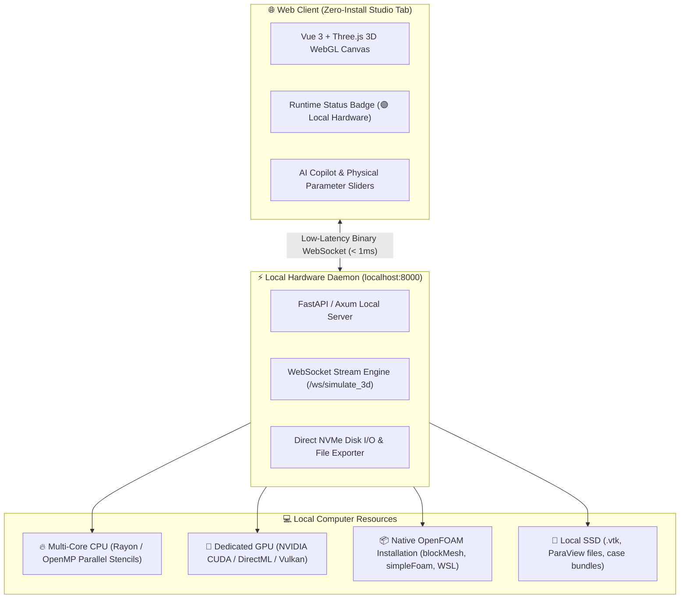

# 💻 Local Hardware Runtime Architecture (Colab-Style Local Bridge)

A comprehensive architectural guide explaining why **3D Computational Fluid Dynamics (CFD)** requires direct local hardware access and how **OpenZess 3D Studio** implements a **Google Colab-style Local Hardware Bridge** connecting web browser tabs directly to local CPUs, GPUs, and native OpenFOAM installations.

---

## 📊 1. The Dimensionality Leap: 2D vs. 3D Computational Reality

Moving from 2D planar simulation to 3D volumetric CFD causes an exponential explosion in computational complexity:

| Dimension / Resolution | Grid Dimensions | Total Active Cells | Pressure Poisson Matrix Bandwidth | Memory Footprint per Time Step | Hardware Requirement |
| :--- | :--- | :--- | :--- | :--- | :--- |
| **2D Planar Toy** | $64 \times 64$ | **$4,096$** | $\approx 16\text{ KB}$ | $< 1\text{ MB}$ | Any browser JS engine |
| **3D Coarse Studio** | $48 \times 48 \times 36$ | **$82,944$** | $\approx 20\text{ MB}$ | $\approx 25\text{ MB}$ | Local Multi-Core CPU |
| **3D Medium Mesh** | $64 \times 64 \times 64$ | **$262,144$** | $\approx 85\text{ MB}$ | $\approx 110\text{ MB}$ | Local CPU / GPU Solver |
| **3D Production CFD** | $128 \times 128 \times 96$ | **$1,572,864$** | $\approx 420\text{ MB}$ | $\approx 850\text{ MB}$ | **Local CUDA GPU + OpenFOAM HPC** |

> [!IMPORTANT]
> Sandboxed cloud web tabs cannot handle $1.5\text{M}+$ 3D cells without staggering cloud server costs, heavy network streaming lag, or crashing the browser tab. Direct local hardware access is the most robust, cost-free, and high-performance solution.

---

## 🏗️ 2. Architectural Blueprint: Web Tab ↔ Local Hardware Bridge



---

## 🌟 3. Key Advantages of the Colab-Style Local Runtime

### 1. 💸 Zero Cloud Compute Costs
- **No server bills**: The user utilizes the powerful CPU (Intel Core / AMD Ryzen / Apple Silicon) and GPU (NVIDIA RTX) already on their desk.
- Infinite simulation run-time without per-minute cloud GPU rental meters.

### 2. 🔒 100% Engineering Privacy & Data Sovereignty
- Proprietary CAD geometries, aerodynamics designs, and room layouts never leave the user's local machine.
- Air-gapped and enterprise-compliant workflow.

### 3. 📦 Native OpenFOAM & Toolchain Execution
- A pure cloud web app cannot interact with software installed on the user's OS.
- With the Local Hardware Daemon:
  - Automatically invokes local `blockMesh`, `snappyHexMesh`, and `checkMesh`.
  - Runs native OpenFOAM solvers (`simpleFoam`, `buoyantBoussinesqSimpleFoam`, `pisoFoam`).
  - Launches desktop **ParaView** directly with one click.

### 4. ⚡ Instant Gigabyte-Scale File I/O
- Large volumetric VTK files ($500\text{ MB} - 2\text{ GB}$) are written directly to local SSDs at $3,500\text{ MB/s}$ NVMe speeds without slow browser download dialogues.

---

## 🎛️ 4. Google Colab-Style Runtime Manager in Header

The top navigation bar features the exact **Google Colab Connection Widget**:

```
Connection Widget:
├── Connected State ────> ✓ RAM [====--] Disk [===---] ▾ (Live memory/disk usage gauges)
├── Connecting State ───> ••• Connecting ▾ (Animated amber indicator)
└── Dropdown Menu ──────>
    ├── 💻 Connect to a local runtime (localhost:8000)
    ├── ⚡ Connect via SSH (Remote Workstation / HPC)
    ├── ⚙️ Change runtime type (CPU Rayon / NVIDIA CUDA GPU / OpenFOAM v2312)
    └── 📊 View resources (Hardware Telemetry Modal)
```

---

## 🚀 5. How to Launch the Local Hardware Runtime

### Option 1: Standard Python Daemon
```bash
python main.py
```

### Option 2: High-Performance Rust Daemon
```bash
cargo run --release
```

### Option 3: Automated One-Click Script (`start_studio.bat`)
Double-click `start_studio.bat` on Windows to start the local hardware server and automatically launch the web tab in your default browser.
