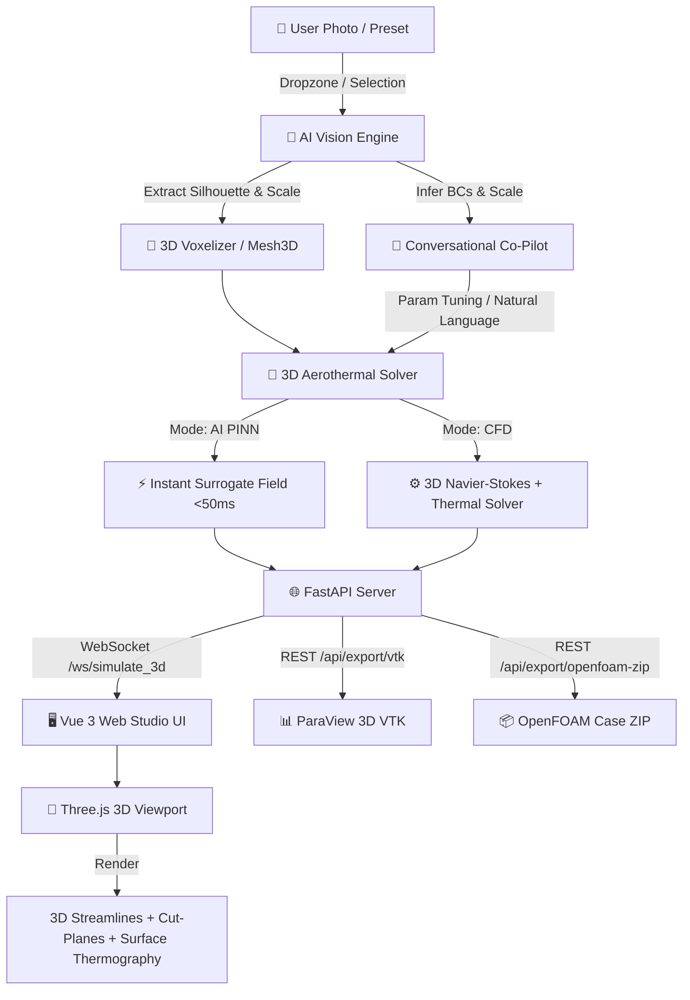

# ⚡ OpenZess 3D Studio — AI-Native CFD & Thermal Simulation Platform

> **Transform any 2D photo into a 3D aerothermal simulation without manually coding OpenFOAM dictionaries.**

[](https://www.openfoam.com)
[](https://fastapi.tiangolo.com)
[](https://vuejs.org)
[](https://threejs.org)
[](LICENSE)

---

## 🌟 The Vision & Why OpenZess Exists

Traditional CFD in **OpenFOAM** requires engineers to manually write and debug dozens of low-level C++ dictionary files (`blockMeshDict`, `controlDict`, `fvSchemes`, `fvSolution`, `0/U`, `0/p_rgh`, `0/T`). Setting up geometry, boundary meshes, and physical properties often takes hours before a single iteration can run.

**OpenZess 3D Studio** revolutionizes this workflow by introducing an **AI Vision & Conversational Co-Pilot Layer**:
1. **Photo-to-3D Ingestion**: Upload a photo of any everyday or industrial object (table, chair, submarine, car, room radiator, server rack).
2. **AI Voxelization & Domain Construction**: The system extracts 2D silhouettes & depth maps, reconstructs a 3D solid obstacle immersed in an enclosure (Room HVAC, Wind Tunnel, or Water Channel), and automatically infers physical scale and boundary conditions.
3. **Coupled Aerothermal Simulation**: Solves 3D Incompressible Navier-Stokes ($\vec{u} = (u, v, w)$), Pressure Poisson ($p$), and 3D Thermal Energy transport ($T$) with Boussinesq thermal buoyancy.
4. **Interactive 3D WebGL Studio**: Live 3D particle streamlines, movable X/Y/Z cross-section cut-planes with thermal/pressure/velocity contours, and 3D raycast flow probing.
5. **Dual Production Export**: Download one-click full OpenFOAM Case `.zip` packages (`buoyantBoussinesqSimpleFoam`) and ParaView 3D `.vtk` files.

---

## 🏗️ System Architecture



---

## 📁 Repository Structure

```
openn_fOam/
├── main.py                     # Entry point: launches FastAPI & auto-opens Web Studio
├── requirements.txt            # Python dependencies (fastapi, uvicorn, scipy, numpy, websockets)
├── README.md                   # Project documentation for collaboration
│
├── backend/                    # Python CFD & AI Physics Engine
│   ├── app.py                  # FastAPI REST APIs + WebSocket simulation streamer
│   ├── mesh_3d.py              # 3D Cartesian Grid generator & Image-to-3D voxelizer
│   ├── solver_3d.py            # 3D Aerothermal Navier-Stokes & Thermal Energy solver
│   ├── ai_vision_engine.py     # Computer Vision analyzer, presets & NLP Co-Pilot
│   ├── openfoam_generator_3d.py# OpenFOAM v2312 Case generator & ZIP packager
│   └── vtk_writer_3d.py        # ParaView 3D Legacy Structured Points (.vtk) exporter
│
└── frontend/                   # Vue 3 + TypeScript + Three.js Web Studio
    ├── index.html              # HTML5 application shell
    ├── vite.config.ts          # Vite build pipeline
    ├── package.json            # Dependencies: Vue 3, Three.js, Chart.js, Lucide
    └── src/
        ├── App.vue             # Master layout and simulation coordinator
        ├── types/cfd.ts        # TypeScript domain models and 3D simulation interfaces
        ├── components/
        │   ├── HeaderNavbar.vue        # Navigation, field selector & export buttons
        │   ├── SidebarControls.vue     # Tabs: AI Co-Pilot, Physics controls, OpenFOAM dicts
        │   ├── AiCopilotChat.vue       # Photo dropzone, presets & conversational AI chat
        │   ├── CfdThree3D.vue          # Interactive 3D Three.js WebGL scene
        │   ├── OpenFoamDictEditor.vue  # Real-time OpenFOAM dictionary inspector
        │   └── ResidualChart.vue       # Logarithmic convergence residual chart
        └── utils/
            ├── colormaps.ts            # Colormaps: Turbo, Coolwarm, Inferno, Jet, Viridis
            └── openfoamDicts3d.ts      # OpenFOAM v2312 3D dictionary templates
```

---

## 🚀 Getting Started

### 1. Prerequisites
- **Python 3.10+**
- **Node.js 18+** & `npm`

### 2. Backend Setup
```bash
# Clone the repository
git clone https://github.com/your-username/openn_fOam.git
cd openn_fOam

# Install Python dependencies
pip install -r requirements.txt
```

### 3. Frontend Setup & Build
```bash
cd frontend
npm install
npm run build
cd ..
```

### 4. Launch OpenZess Studio
```bash
python main.py
```
*The browser will automatically open at `http://localhost:8000/studio/index.html`.*

---

## 🎯 How the End-to-End Workflow Operates

1. **Upload or Select Object**:
   - In the **🤖 AI Co-Pilot** tab, drop an image of a table, chair, submarine, car, or heater, or click a preset chip.
   - The AI vision module instantly detects the archetype, computes bounding dimensions ($L \times W \times H$), and estimates flow regime parameters.

2. **Conversational Refinement**:
   - Talk to the AI Co-Pilot: *"Increase inlet air speed to 4.5 m/s"*, *"Heat the radiator to 60°C"*, or *"Switch to underwater channel"*.
   - The Co-Pilot updates boundary conditions, explains the fluid mechanics rationale, and synchronizes OpenFOAM files.

3. **3D Aerothermal Simulation**:
   - Click **🚀 Run 3D Simulation**.
   - Watch live 3D streamline particles trace flow lines around the reconstructed obstacle.
   - Move the **XY**, **XZ**, or **YZ** cut-plane sliders to examine 2D cross-sectional contours of Temperature ($T$), Pressure ($p$), or Velocity ($|U|$).
   - Hover anywhere in the 3D room to probe exact point values.

4. **Production Export**:
   - Click **📦 OpenFOAM Case (.zip)** to get a complete, runnable OpenFOAM simulation folder.
   - Click **📊 ParaView 3D (.vtk)** to export high-resolution structured 3D grids for ParaView or PyVista post-processing.

---

## 🤝 Contributing & Collaboration

We welcome contributions from CFD practitioners, aerodynamicists, and full-stack developers!

1. Fork the Project.
2. Create your Feature Branch (`git checkout -b feature/NewObstaclePrimitive`).
3. Commit your changes (`git commit -m 'Add drone quadcopter 3D primitive'`).
4. Push to the Branch (`git push origin feature/NewObstaclePrimitive`).
5. Open a Pull Request.

---

## 📄 License
Distributed under the MIT License. See `LICENSE` for more information.
