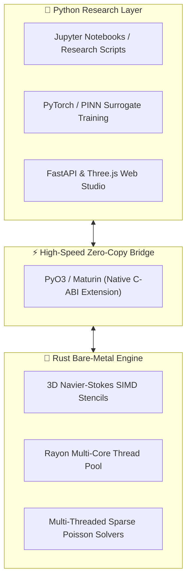

# 🔬 Hybrid Python + Rust Architecture for CFD & AI Research

This document outlines how to combine **Python** and **Rust** in this project to create a research platform for **benchmarking, AI surrogate training, parameter sweeps, and academic publication**.

---

## 🌟 Why a Dual Python + Rust Architecture is Ideal for Research

In scientific and academic CFD research, you need two competing qualities:
1. **Python's Flexibility**: Rapid prototyping, Jupyter notebooks, PyTorch/TensorFlow deep learning, data plotting (Matplotlib/Seaborn), and AI prompt engineering.
2. **Rust's Raw Speed & Parallelism**: Bare-metal SIMD hardware acceleration, multi-core CPU scaling with Rayon, and sub-millisecond 3D numerical loops.

By integrating both via **`PyO3` / `maturin`**, you get the best of both worlds.



---

## 🚀 3 Powerful Research Capabilities Enabled by Hybrid Python + Rust

### 1. 📊 Automated Latency & Scaling Benchmarking (Paper-Ready Results)
You can directly compare execution times between Python, Rust, and OpenFOAM across grid resolutions ($32^3, 64^3, 128^3$):

```python
# Research Benchmark Script (scratch/benchmark_python_vs_rust.py)
import time
import openzess_core_py as solver_py
import openzess_core_rs as solver_rs  # Compiled Rust kernel

# Run 500 iterations in Python
t0 = time.perf_counter()
res_py = solver_py.run_simulation(iters=500, nx=48, ny=48, nz=36)
t_python = time.perf_counter() - t0

# Run 500 iterations in Rust (Rayon parallel)
t0 = time.perf_counter()
res_rs = solver_rs.run_simulation(iters=500, nx=48, ny=48, nz=36)
t_rust = time.perf_counter() - t0

print(f"Python Time: {t_python:.2f}s | Rust Time: {t_rust:.2f}s (Speedup: {t_python/t_rust:.1f}x)")
```

---

### 2. 🧠 Ultra-Fast Dataset Generation for AI & PINN Surrogates
- Training Physics-Informed Neural Networks (PINNs) or Fourier Neural Operators (FNO) requires **thousands of 3D flow field ground-truth samples** across varying geometries (different table/chair sizes, submarine angles of attack, heater temperatures).
- In pure Python, generating 5,000 3D flow cases takes **days**.
- With the **Rust multi-threaded engine**, 5,000 cases can be generated in **under an hour**, directly feeding into PyTorch training pipelines.

---

### 3. 🎯 Selectable Multi-Engine UI for Demonstrations
In the Web Studio interface, you can add a selectable engine dropdown:
- **Engine 1: ⚡ Instant 3D PINN AI Surrogate** ($<50\text{ ms}$)
- **Engine 2: 🔬 Python SciPy Fractional-Step Solver** (Educational / Baseline)
- **Engine 3: 🦀 Rust SIMD + Rayon Multi-Core Solver** (Real-Time 120 FPS High-Fidelity)
- **Engine 4: 📦 OpenFOAM v2312 Native Runner** (Ground Truth Validation)

---

## 🛠️ How to Add the Rust Engine with `PyO3` & `maturin`

### Step 1: Install Maturin in your Python environment
```bash
pip install maturin
```

### Step 2: Initialize Rust Extension Workspace
```bash
maturin new --bin-or-lib lib openzess_rs
```

### Step 3: Build the Native Python Package
```bash
cd openzess_rs
maturin develop --release
```
*This compiles the Rust 3D CFD kernel into a native Python module (`import openzess_rs`) that runs at 100% bare-metal C/Rust speed.*

---

## 📑 Next Steps for Your Research
1. **Benchmark Matrix**: Publish comparative performance tables across grid resolutions ($32^3 \to 128^3$).
2. **Validation Study**: Compare velocity profiles $u(y)$ and temperature $T(z)$ against native OpenFOAM `buoyantBoussinesqSimpleFoam` and Ghia cavity literature data.
3. **Geometry Ingestion**: Test real-world photos of complex obstacles (drones, heat sinks, room layouts).
