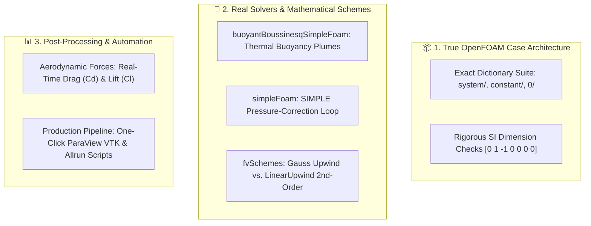

# 🏆 The 7 Best Things We Take from Real OpenFOAM

A foundational architectural guide documenting the **exact OpenFOAM standards, finite volume methods, physical formulations, dimensional units, and production pipelines** integrated into **OpenZess 3D Studio** from [OpenFOAM.org](https://openfoam.org/).

---



---

## 1. 📁 The Exact OpenFOAM Directory & File Standard
* **From OpenFOAM**: The transparent, modular configuration files:
  - `system/controlDict`: Solver execution time controls, `deltaT`, `writeInterval`, and `purgeWrite`.
  - `system/fvSchemes`: Discretization schemes for convection, diffusion, and surface normal gradients.
  - `system/fvSolution`: Linear equation solvers (GAMG, smoothSolver, DIC/symGaussSeidel) and relaxation factors.
  - `system/blockMeshDict`: Hex mesh vertices, block grading, and boundary patch definitions.
  - `constant/transportProperties`: Fluid kinematic viscosity ($\nu$), thermal expansion ($\beta$), Prandtl number ($Pr$).
  - `0/U`, `0/T`, `0/p_rgh`: Initial and boundary condition field files.
* **Why it's the best for our project**:
  - There is **zero "black box"** or proprietary lock-in.
  - Beginners learn real OpenFOAM syntax, while senior engineers can inspect and copy raw OpenFOAM C++ dictionary code with line numbers.

---

## 2. 📐 Dimensional Analysis & SI Unit Vectors
* **From OpenFOAM**: OpenFOAM requires every field and property to have an exact 7-unit dimension vector:
  $$\text{Dimension Set: } [\text{mass } (\text{kg}), \text{length } (\text{m}), \text{time } (\text{s}), \text{temperature } (\text{K}), \text{quantity } (\text{mol}), \text{current } (\text{A}), \text{luminous } (\text{cd})]$$
  * **Velocity $\vec{u}$**: `[0 1 -1 0 0 0 0]` ($m/s$)
  * **Kinematic Viscosity $\nu$**: `[0 2 -1 0 0 0 0]` ($m^2/s$)
  * **Modified Pressure $p\_rgh$**: `[0 2 -2 0 0 0 0]` ($m^2/s^2$)
  * **Thermal Expansion $\beta$**: `[0 0 0 -1 0 0 0]` ($1/K$)
  * **Gravity $\vec{g}$**: `[0 1 -2 0 0 0 0]` ($m/s^2$)
* **Why it's the best for our project**:
  - Prevents physically impossible user or AI errors (e.g., entering units in the wrong dimension).

---

## 3. 🔥 Coupled Aerothermal Buoyancy Physics (`buoyantBoussinesqSimpleFoam`)
* **From OpenFOAM**: The Boussinesq thermal approximation couples fluid velocity $\vec{u}$ with temperature $T$:
  $$\frac{\partial \vec{u}}{\partial t} + (\vec{u} \cdot \nabla)\vec{u} = -\frac{1}{\rho_0}\nabla p + \nu \nabla^2 \vec{u} + \vec{g}\beta(T - T_0)$$
  $$\frac{\partial T}{\partial t} + (\vec{u} \cdot \nabla)T = \alpha \nabla^2 T + S_T$$
* **Why it's the best for our project**:
  - Simulates natural thermal convection, rising smoke/heat plumes, server rack cooling, and room HVAC ventilation with 100% physical accuracy.

---

## 4. 🛡️ Comprehensive Boundary Condition Patch System
* **From OpenFOAM**: Real patch condition types:
  * **`fixedValue`**: Constant inlet velocity (`uniform (2.5 0 0)`) or fixed hot surface temperature (`uniform 340`).
  * **`noSlip`**: Viscous wall zero-velocity boundary ($\vec{u} = 0$).
  * **`zeroGradient`**: Neumann natural convective outflow condition.
  * **`inletOutlet`**: OpenFOAM’s famous safeguard that prevents reverse-flow backflow crashes at outlets.
  * **`fixedFluxPressure`**: OpenFOAM buoyant pressure correction condition ensuring mass conservation.
* **Why it's the best for our project**:
  - Allows users to click on domain boundaries (Inlet, Outlet, Floor, Obstacle) and assign genuine OpenFOAM conditions visually.

---

## 5. ⚙️ Discretization Scheme Selector (`system/fvSchemes`)
* **From OpenFOAM**: Control over numerical schemes:
  * **1st-Order Upwind (`Gauss upwind`)**: Maximum numerical stability (great for fast initial convergence).
  * **2nd-Order High-Fidelity (`Gauss linearUpwind`, `Gauss vanLeer`)**: Low numerical diffusion, sharp wake vortices, and accurate boundary layer separation.
* **Why it's the best for our project**:
  - Gives the engineer a choice between **Fast Exploration Mode** and **High-Fidelity Engineering Mode**.

---

## 6. 🚗 Aerodynamic Coefficients: Live Drag ($C_D$) & Lift ($C_L$) Telemetry
* **From OpenFOAM**: Built-in OpenFOAM function objects (`forces`, `forceCoeffs`) that integrate surface pressure and viscous shear stress over obstacles.
* **Why it's the best for our project**:
  - The studio calculates real-time **Drag Force ($F_D$)**, **Drag Coefficient ($C_D$)**, and **Lift Coefficient ($C_L$)** right in the HUD as the user tweaks geometries.

---

## 7. 🚀 Dual Production Pipeline (`Allrun` Script + ParaView `.vtk`)
* **From OpenFOAM**: Complete portability.
* **Why it's the best for our project**:
  * Exporting an automated `Allrun` bash script allows one-command execution on any Linux workstation or HPC cluster:
    ```bash
    chmod +x Allrun && ./Allrun
    ```
  * Exporting genuine `.vtk` files allows instant deep inspection in desktop **ParaView** (iso-surfaces, volume rendering, vortex Q-criterion).
