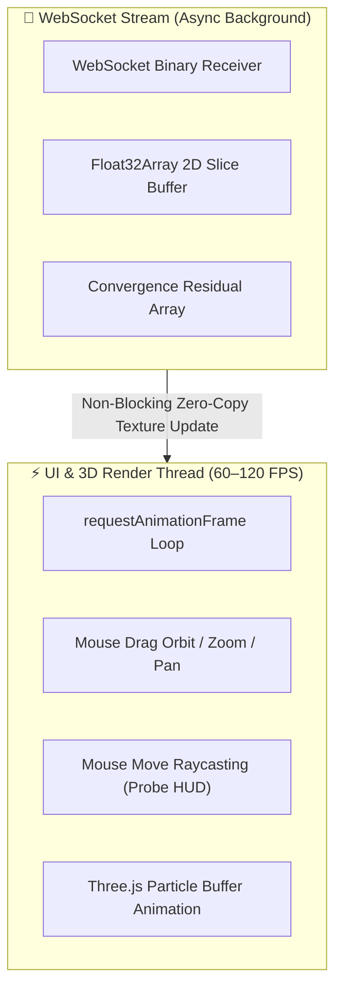

# 🎨 OpenZess 3D Studio — UI/UX Design System & Layout Specification

A comprehensive design document defining the visual aesthetics, component layout, interaction patterns, design tokens, and **60–120 FPS zero-latency rendering architecture** for the **OpenZess 3D Studio** interface.

---

## 🔬 1. Design Philosophy: "Clean Modern Scientific Studio"

The UI is built with a **modern research lab / scientific engineering aesthetic** in a **Split-Screen Studio** arrangement:

1. **Split-Screen Layout**:
   - **Left Half (OpenFOAM Case Hub)**: Complete OpenFOAM case tree (`system/`, `constant/`, `0/`), dual mode toggle (`[ 🤖 AI Copilot ]` vs `[ ⚙️ Manual OpenFOAM ]`), parameter sliders, photo dropzone, and contextual OpenFOAM.org documentation tooltips.
   - **Right Half (3D CFD Viewport)**: High-precision interactive 3D WebGL CFD simulation viewport with volumetric thermal plume, dynamic streamlines, cut-planes, and camera orbit controls.
2. **High-Contrast Scientific Legibility**: Crisp dark canvas (`oklch(20.5% 0 none)`), elevated card panels (`oklch(37.8% 0.015 216)`), and crisp high-contrast text (`oklch(88.2% 0.059 254.128)`).
3. **Exact Google Colab-Style Runtime Manager**: Connected widget with mini RAM & Disk telemetry meters (`✓ RAM [===] Disk [===] ▾`) and dropdown menu.

---

## 🎨 2. Custom OKLCH Design Tokens & Surface Hierarchy

The design system is engineered with a **4-tier OKLCH surface and typography hierarchy** paired with a **vibrant aerothermal plume spectrum**:

### 🏛️ Surface & Typography Tokens (OKLCH):
1. **Base Background Canvas (1st Layer)**: `oklch(20.5% 0 none)`
   - Deep Obsidian Base canvas for the full studio viewport and canvas backdrop.
2. **Secondary Typography & Inactive Borders (2nd Layer)**: `oklch(70.7% 0.022 261.325)`
   - Muted scientific labels, inactive tree icons, and subtle structural grid lines.
3. **Card Panels & High-Contrast Typography (3rd Layer)**:
   - **Panel & Input Surface**: `oklch(37.8% 0.015 216)` — Elevated card panels, parameter containers, and code editor surfaces.
   - **Primary High-Contrast Text**: `oklch(88.2% 0.059 254.128)` — Crisp, high-contrast headings, numerical values, and active status text.
4. **Header Navbar & Sidebar Base (4th Layer)**: `oklch(26.9% 0 none)`
   - Solid, elevated navigation bar, modal containers, and case tree root background.
5. **Colab Widget & Button Surfaces**: `oklch(20.5% 0 none)`
   - Dark charcoal buttons with `border border-white/10` and high-contrast text.

### 🌟 Accent & Brand Tokens:
- **Brand Logo Gradient**: `linear-gradient(135deg, oklch(43.8% 0.218 303.724), oklch(40.5% 0.101 131.063))` — Royal Magenta/Violet $\to$ Deep Emerald Moss (3D Isometric Cube Icon)
- **Primary Brand / Action**: `oklch(62.3% 0.214 259.815)` — Vibrant Sapphire Blue (Run buttons, Primary active states)
- **Active Highlight & Runtime Pill**: `oklch(77.7% 0.152 181.912)` — Luminous Cyan (`🟢 Local PC Runtime`, active meters)
- **Mode Toggle & Focus**: `oklch(67.3% 0.182 276.935)` — Electric Iris / Royal Violet
- **Volumetric Thermal Plume Core**: `#fbbf24` / `#f59e0b` — Radiant Butterscotch Amber Gold (Heat flux $T_{source}$)

---

## 🖼️ 3. Visual UI/UX Studio Target (Google Colab Runtime Widget + OKLCH Tokens)

Below is the design target showcasing the **exact Google Colab-style runtime button (`✓ RAM [===] Disk [===] ▾`)**, the **`oklch(20.5% 0 none)` button surfaces**, and the **OpenFOAM Case Hub**:


---

## 📐 4. Desktop Screen Layout & Component Blueprint

```
┌────────────────────────────────────────────────────────────────────────────────────────────────────────────────────────┐
│ 🔮 OpenZess 3D Studio        [✓ RAM ▇▇░ Disk ▇░░ ▾] [▶ Run] [⏸ Pause] [↺ Reset]                [Export OpenFOAM Case ▾]│
├───────────────────────────────────────────────────────┬────────────────────────────────────────────────────────────────┤
│ 📁 OpenFOAM Case Hub (AI & Manual)                    │                                                                │
│ ┌───────────────────────────────────────────────────┐ │                                                                │
│ │ Mode:  [ 🤖 AI Copilot ]  |  [ ⚙️ Manual OpenFOAM ] │ │                                                                │
│ └───────────────────────────────────────────────────┘ │                                                                │
│                                                       │                                                                │
│ 📂 OpenFOAM Case Tree:                                │                   3D Three.js CFD Viewport                     │
│    ├── 📁 system/                                     │                                                                │
│    │   ├── controlDict   (solver, deltaT, write)      │         ┌──────────────────────────────────────────────┐       │
│    │   ├── fvSchemes     (divSchemes, laplacian)      │         │   3D Volumetric Thermal Plume & Streamlines  │       │
│    │   ├── fvSolution    (GAMG, PIMPLE, tolerances)   │         │   • Luminous Sapphire/Cyan Billowing Edges   │       │
│    │   └── blockMeshDict (nx, ny, nz resolution)      │         │   • Radiant Golden Core ($T_{source}$)       │       │
│    ├── 📁 constant/                                   │         │   • Interactive XY/XZ Cut-Plane Contours     │       │
│    │   └── transportProperties (ν, β, Pr, g)          │         │   • 📍 Hover Flow Probe Tooltip HUD          │       │
│    └── 📁 0/ (Boundary Patches)                       │         └──────────────────────────────────────────────┘       │
│        ├── U (inlet fixedValue, walls noSlip)         │                                                                │
│        ├── p_rgh (fixedFluxPressure)                  │ ────────────────────────────────────────────────────────────── │
│        └── T (heater heatFlux, ambient T_0)           │ 📈 Real-Time Logarithmic Residual Monitor                      │
│                                                       │ ┌────────────────────────────────────────────────────────────┐ │
│ 📸 AI Photo/CAD Dropzone & Archetypes                 │ │ 10⁰ ─────────────────────────────────────────────────────  │ │
│ ℹ️ OpenFOAM.org Knowledge Box & Solver Documentation  │ │ 10⁻² ───\─── Continuity (Ux, Uy, Uz)                      │ │
│                                                       │ │ 10⁻³ ────\── Energy (T)                                   │ │
│                                                       │ └────────────────────────────────────────────────────────────┘ │
└───────────────────────────────────────────────────────┴────────────────────────────────────────────────────────────────┘
```

---

## ⚡ 5. Decoupled Zero-Latency Interaction Patterns



1. **Independent 3D Animation Loop**: Three.js renders fluidly at 60–120 FPS regardless of backend solver cycle intervals.
2. **Binary ArrayBuffer Updates**: Cross-section cut-plane heatmaps are uploaded directly to GPU `CanvasTexture` using raw `Float32Array` buffers ($16\text{ KB}$), bypassing heavy JSON parsing.
3. **Optimistic UI Updates**: Slider adjustments immediately update local 3D boundary visualizations before the WebSocket acknowledges the parameter sync.
